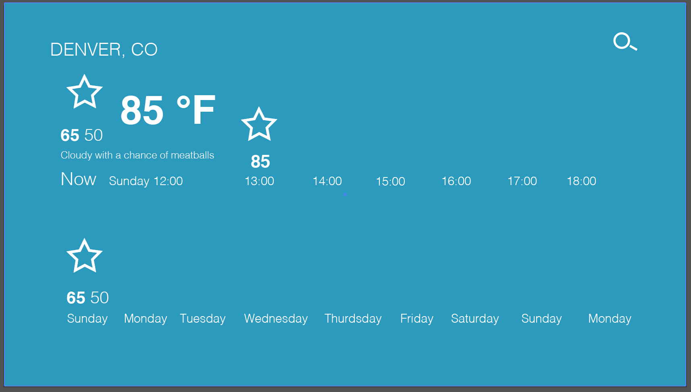

# Weathrly 

Weather forecast application using ReactJS with the Weather Underground API. Gives current, hourly, and daily conditions based on City entered into search. Incorporates autocomplete functionality, as well as welcome and error pages. Clean and simple UI for pleasant and logical user interaction. 

## Result

<!-- [] -->

<!-- [] -->

<!-- [] -->

## Design Inspiration

* Micro-Interaction Inspiration

 
 
  

* Page Design Inspiration

 
 
 

* Initial Wireframe

 

This project was bootstrapped with [Create React App](https://github.com/facebookincubator/create-react-app).
